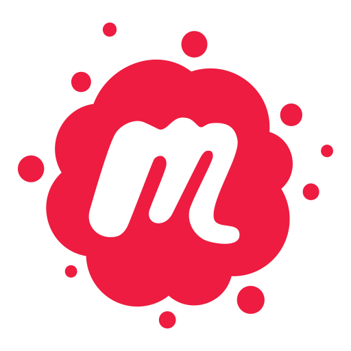

# Curriculum Vitae

## Professional Activity

#### 01/11/2016 – now

##### Technical Lead Android Development at [Adorsys GmbH & Co KG](https://adorsys.de/)

- Development and maintenance of different apps for diverse customers ([Teambank](https://www.teambank.de/) / [DATEV](https://www.datev.de/web/de/startseite/startseite-n) / [NIEHOFF](https://www.niehoff-gmbh.info/de/) / [in-house](https://adorsys.de/))
- Focus: architecture mobile apps, data security
- App [Fymio](https://play.google.com/store/apps/details?id=de.teambank.fymio)
- Open-Source Libraries [Secure Storage](https://github.com/adorsys/secure-storage-android) & [Finger](https://github.com/adorsys/fingerprint-android)
- Tags: Kotlin (Multiplatform), Architecture, Android Things, Jetpack, Flutter, Android Keystore, Security / Encryption

#### 01/08/2016 – 31/10/2016

##### Senior Android Developer at [Adorsys GmbH & Co KG](https://adorsys.de/)

- Development and maintenance of apps for different customers ([KURZ](https://www.kurz.de/) / [Bausparkasse Schwäbisch Hall](https://www.schwaebisch-hall.de/) / [Ergo Direkt](https://www.ergo.de/) / [in-house](https://adorsys.de/))
- Tags: Open GL

#### 01/01/2016 – 31/07/2016

##### Team Lead Conrad Competence Center Berlin at [Conrad Electronic SE](https://www.conrad.de/)

- Responsibility for "technical coordination of Conrad Competence Center Berlin"
- "technical development, supervision and motivation of staff"
- Organizational planning for mobile applications and innovations
- Communication with stakeholders
- Tags: project planning, team lead

#### 01/12/2014 – 31/07/2016

##### Lead Android Developer Conrad Competence Center Berlin at [Conrad Electronic SE](https://www.conrad.de/)

- Responsibility for the Android project (project planning / coordination / cost estimate / communication with external developers / testers / definition of code styles / guidelines / quality assurance)
- Organizational planning for mobile applications and innovations
- Tags: code reviews, Git Flow, CI (Jenkins), architecture, code style / quality, dynamic UI, Material Design

#### 01/10/2014 – 31/12/2015

##### Android Developer at [Fairmondo eG](https://www.fairmondo.de/)

- Voluntary self-dependent development of mobile shopping app for Fairmondo
- Conception Architecture, UI / Connection to REST API
- Tags: Animations, Custom views, endless scrolling, Search, Search suggestions

#### 01/04/2013 – 30/09/2014

##### Working student / Android Developer at ][init](https://www.init.de/de)[ AG für digitale Kommunikation

- Self-dependent development of Android projects and team work projects, apps
- App [Nationalpark Berchtesgaden](https://play.google.com/store/apps/details?id=de.bayern.berchtesgaden)
- App [KFZ-Steuerrechner](https://play.google.com/store/apps/details?id=de.bundesfinanzministerium.kfzrechner)

## Voluntarily Activity

#### Organizer GDG (Google Developer Group) Nuremberg Android

- A local community-ran meetup for developers interested in resources and technology from Google. It especially targets Android Developers or those who want to become Android developers. The main goal is to discuss news, best practices of the Android universe while sitting together amongst people who share the same professional background and are interested in the same technologies.
- In addition to that, we try to have at least one talk or workshop per meeting about anything related to Android coding. This might either be the hottest new technology or just best practices you would like to share.

## Academic Education

#### 01/04/2011 – 30/09/2014

- Bachelor of Applied Computer Science (Focus Mobile Applications) at University of Applied Sciences Berlin (HTW)
- Focus Mobile Applications: e.g.: Base iOS / Android

#### 01/10/2003 – 30/09/2009

- Diploma in German Literature (Focus Promotion of Literature)
- Minor Philosophy at Otto-Friedrich-Universität Bamberg

#### 01/09/2005 – 22/04/2006

- Erasmus Studies “Germaniques“ and Philosophy at Université Michel Montaigne Bordeaux 3

## Bachelor Thesis

Android app for sharing guerrilla prose, a short inspirational text in combination with an image
- Conception / programming / testing of a PHP backend (with Laravel / Nginx on Raspberry Pi)
- Conception / programming / testing of Android app with RESTful interface to  Flickr API / own server
- RESTless services
- Custom Views
- Asynchronous Server communication

## Social Media

 &nbsp;&nbsp;&nbsp; 
 &nbsp;&nbsp;&nbsp;
 &nbsp;&nbsp;&nbsp;
 &nbsp;&nbsp;&nbsp;
 &nbsp;&nbsp;&nbsp;
 &nbsp;&nbsp;&nbsp;
